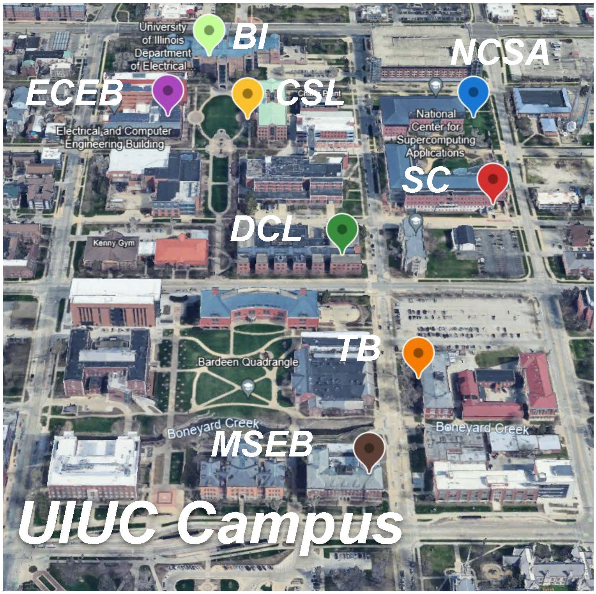

# DoorBot: Closed-Loop Task Planning and Manipulation for Door Opening in the Wild with Haptic Feedback
This is the official repository for the paper: DoorBot: Closed-Loop Task Planning and Manipulation for Door Opening in the Wild with Haptic Feedback.

[[website] (todo...)]() [[paper]](DoorBot_ICRA2025.pdf) [[video]](https://youtu.be/_7GVSsXtLFg)


We propose a hierarchical closed-loop controller to help a mobile robot automatically open various doors and walk through them in open environments. Our method can robustly generalize to different handles in the wild.

## 1. Hardware Setup
The hardware setup and issues log for the RealMan Mobile Bimanual Humanoid Robot can be found in [RealMan Hardware Doc](/docs/realman_hardware_doc.md)

You can check [RealMan Software Doc](/docs/realman_software_doc.md) to learn how to control different parts of the robot using python3 API code.


Visual appearance and configurations of our bimanual mobile robot.

## 2. Door Opening
### Server
`DTSAM` / `RANSAC` / `GUM` need to run on the server.
You can check [server.py](/open_door/server.py) and [cfg_server.yaml](/open_door/cfg/cfg_server.py) to setup the server.
Then get the code to the server:

```
conda create -n doorbot python=3.8
conda activate doorbot
cd /your/root/path/
git clone https://github.com/TX-Leo/DoorBot.git
```

You can check [dtsam_package](/open_door/dtsam_package), [ransac_package](/open_door/ransac_package), and [gum_package](/open_door/gum_package) to set up the dependencies.

## Local
### Get the code:
```
conda create -n doorbot python=3.8
conda activate doorbot
cd /your/root/path/
git clone https://github.com/TX-Leo/DoorBot.git
```

### Opening-door task:
```
cd open_door
```
For testing:
```
python main.py -n 0 -t lever
```
It will do the action step by step.

open_loop:
```
python open_loop.py -n 0 -t lever
```

close-loop:
```
python close_loop_SM_GUM.py -n 0 -t lever
```

## 3. Primitives
We design six motion primitives based on the key steps of opening doors and implement them through low-level controllers. This reduces the dimensionality of the action space and avoids reliance on extensive human expert data.

The high-level planner (state machine) and the low-level controllers (6 primitives) are implemented in the [primitive.py](/open_door/primitive.py) file.

You can check out [prompt.py](/open_door/prompt.py) for the textual input for VLM including high-level and low-level.

## 4. Grasping-and-Unlocking Model (GUM)

Overview of GUM. GUM refines the model-based grasp pose prior for the grasp primitive, and simultaneously predicts the motion trajectory for unlocking the door handle.

### Dataset
We create a dataset of 1,303 images featuring various door handles, collected from the Internet and real-world photos. The dataset includes four common handle types: lever handles, doorknobs, crossbars, and cabinet handles. Based on object masks generated by Detic and SAM, we manually label the appropriate grasp point and rotation parameters on the images.

- GUM Dataset (Original): 1303
  - Internet: 766
  - Real-World: 537
      - xxx.HEIC: rgb image
      - xxx.jpg: rgb image
      - xxx_mask.png: handle mask image
      - xxx.json: bounding box info of handle (w,h,box,Cx,Cy,orientation); Grasp Offset (dx,dy); Unlock Axis (R)
      - xxx.txt: box[0],box[1],box[2],box[3],dx,dy,R
      - xxx_annotated.png: handle annotated image

Original dataset (before augmentation) can be found in [here (todo ...)](/docs/realman_software_doc.md).
You can run [handle_data_augmentation.py](/open_door/gum_package/handle_data_augmentation.py) for data augmentation.


### Training
```
cd gum_package
python train.py
```
You can check checkpoints in [checkpoints (todo ...)]().

## 5. Haptic Feedback

Haptic feedback in 3 motion primitives. For unlock-lever and unlock-knob, the current threshold for the elbow joint tells the robot when to stop. For open the increase/decrease of current feedback on the elbow joint shows the push-/pull-type of the door.

The haptic feedback is implemented in the [primitive.py](/open_door/primitive.py) and [arm.py](/open_door/arm.py).


## 6. Main Results


Our method consistently outperforms other combinations, showing an average success rate improvement from 50% to 90% across all manipulation tasks. None of the doors nor the handles are seen in the training set, proving our model’s generalizability across different situations.

<!-- ## 3. system architecture


## 4. GUM


## 5. closed-loop


## 6. Exp Setting



## 7. Results
 -->