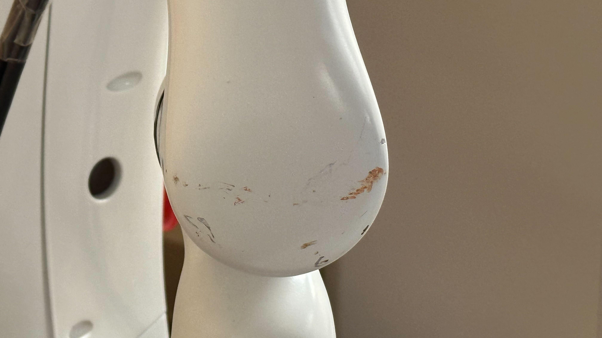

<!--
 * @Author: TX-Leo
 * @Mail: tx.leo.wz@gmail.com
 * @Date: 2024-08-10 16:45:51
 * @Version: v1
 * @File: 
 * @Brief: 
-->
# Realman Humanoid Robot Hardware Issue Log

> 🎞️Author:Leo ([tx.leo.wz@gmail.com](mailto:tx.leo.wz@gmail.com "tx.leo.wz@gmail.com"))
> 
> Last Edited: 2024.08.10
>
>
## Content

- [Realman Humanoid Robot Hardware Issue Log](#realman-humanoid-robot-hardware-issue-log)
  - [Content](#content)
    - [problem: can't connect to camera](#problem-cant-connect-to-camera)
    - [problem: can't connect to head](#problem-cant-connect-to-head)
    - [problem: can't connect to server (dtsam/ransac/hgum failed)](#problem-cant-connect-to-server-dtsamransachgum-failed)
    - [problem: can't connect to the gripper](#problem-cant-connect-to-the-gripper)
    - [problem: can't connect to the arm](#problem-cant-connect-to-the-arm)
    - [problem: can't connect to base](#problem-cant-connect-to-base)
    - [Note: the shell of the robot](#note-the-shell-of-the-robot)
    - [Note: The robot has already had a bunch of injuries😢, like them:](#note-the-robot-has-already-had-a-bunch-of-injuries-like-them)
    - [Note: the lidar of base](#note-the-lidar-of-base)
    - [Note: the wheels of the robot](#note-the-wheels-of-the-robot)

### problem: can't connect to camera

1. check the extension cable connection
2. reinsert camera usb cable ( It happens usually, but I don't know the reason, maybe should change to another realsense)

### problem: can't connect to head

1. check the extension cable connection
2. check the USB2TTL adapter

3.check the connection inside the robot ( sometimes it's easy to fall!)

### problem: can't connect to server (dtsam/ransac/hgum failed)

1. check ALTA (sometimes ALTA's fan will work drastically, it's a signal that the server has something wrong, but nobody knows what's going on), the only method should be restart the alta(mush reinsert the power cable)&#x20;
2. the CUDA memory is not enough, maybe somebody is using it; you can change to another gpu
3. you should connect to IllinoisNet

### problem: can't connect to the gripper

1. check the Ethernet cable connection (sometime it's not stable)
2. sometimes it fails, you can reconnect it for few times

### problem: can't connect to the arm

1. check the Ethernet cable connection (sometime it's not stable)
2. hardware damage, this part of gripper is fragile which should be taken more care of. (I have changed one, so the two gripper cable on the robot are the last two)'

   
3. sometimes there will be one joint stuck after initialization, it can be fixed by conneted it again

### problem: can't connect to base

1. check the Ethernet cable connection (sometime it's not stable)

### Note: the shell of the robot

- Be careful. Because of the terribleIK the company provides😅, it has a big chance of self collision when arm moving!!!
- Better not tighten the screws on the two shells of the robot's back, in case of ruining these cables.

### Note: The robot has already had a bunch of injuries😢, like them:

### Note: the lidar of base

The base has a ability of avoiding obstacle automatically  near the robot ( maybe 20cm). If you don't want to have this kind of ability, you can just cover the lidar of the base easily, like this:

### Note: the wheels of the robot

The wheels of the robot are strong enough to walk on the ground in the wild, so don't be worried that it will cause the damage to them. (only the smallest one is the the most possible to be destoried)

